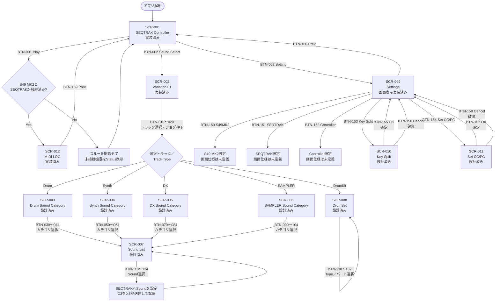
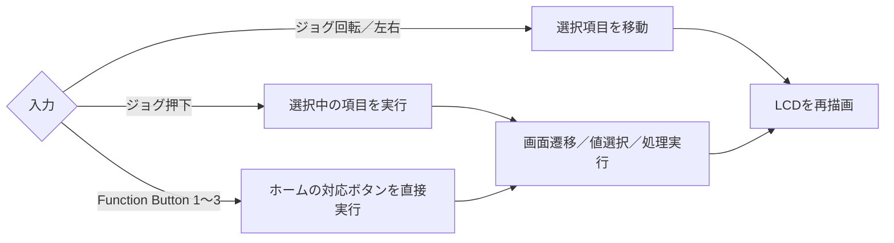
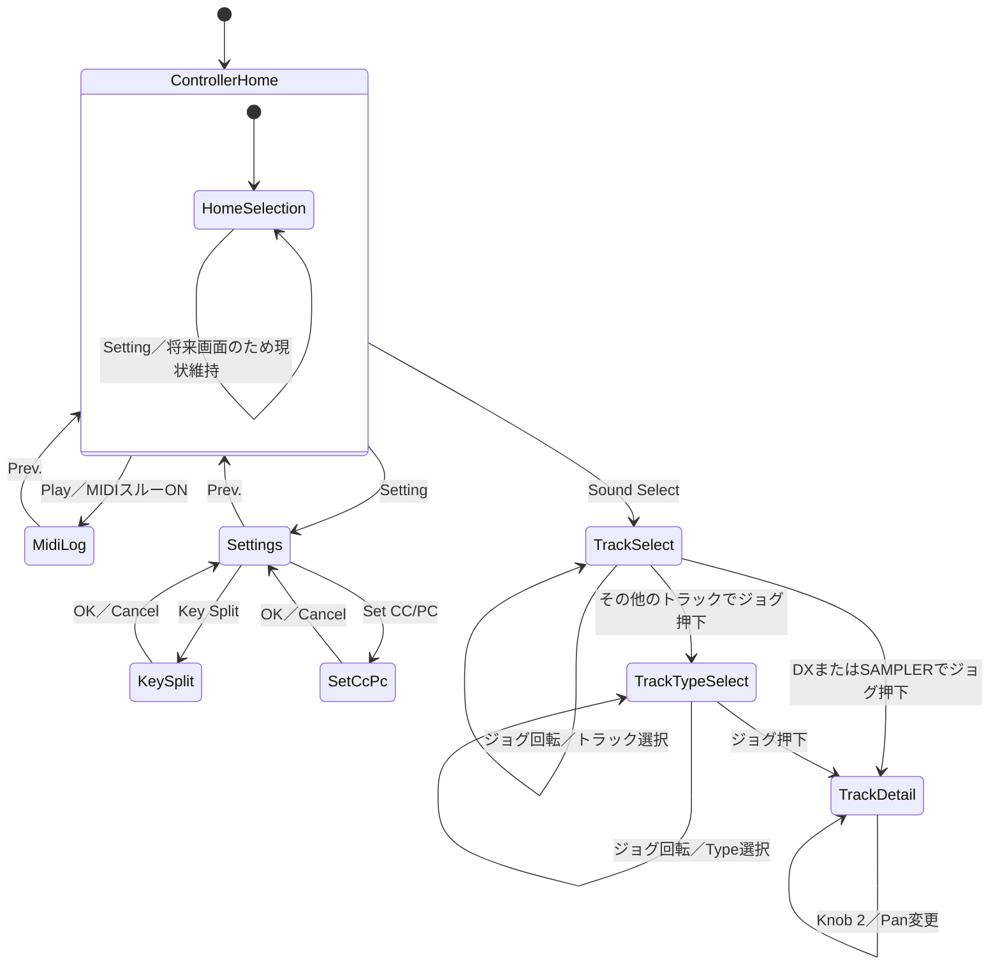
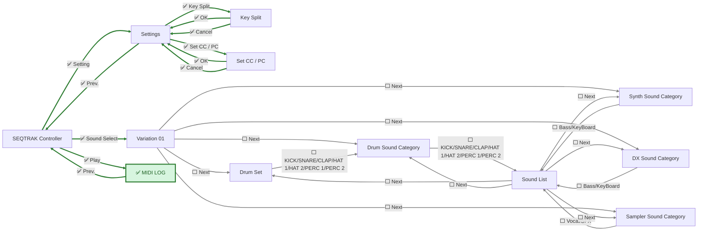

# 画面・ボタン操作フロー

`screens.md`、`buttons.md`、C++実装、およびPenpotファイル
`S49MK2 Controller`の`Shinonome12 Layouts`ページを基にしたフローです。

## 表記

- 実線: 仕様として定義されている画面遷移または処理
- 点線: Penpot Prototypeだけに設定されている遷移
- 「設計済み」: Penpotに画面はあるが、C++では未実装
- 「未定義」: ボタンは定義されているが、遷移先画面の仕様がない

## 仕様上の画面・ボタンフロー

`Play`はMIDIスルーを開始し、SCR-012 `MIDI LOG`へ遷移します。

## 共通の操作フロー

SCR-002の現在のC++実装では、ジョグ押下後も別画面へは遷移せず、同一画面内で
`TrackSelect` → `TrackTypeSelect` → `TrackDetail`とモードが変わります。
`TrackDetail`ではKnob 1がVolume、Knob 2がPanを変更します。

## 現在のC++実装フロー

現状のC++で画面IDとして実装されているのは`ControllerHome`、
`SoundSelect`、`Settings`、`KeySplit`、`SetCcPc`、`MidiLog`です。
カテゴリ、Sound List、DrumSetへの遷移は未実装です。

## Penpot Prototype遷移

Penpotで確認できたClick → Navigate toのみを抜き出した図です。

- 緑・`✅`: C++で遷移を実装・検証済み
- 灰・`⬜`: 未実装

Settings内の図示されていないその他のボタンには、Penpot Prototypeリンクは
設定されていません。
